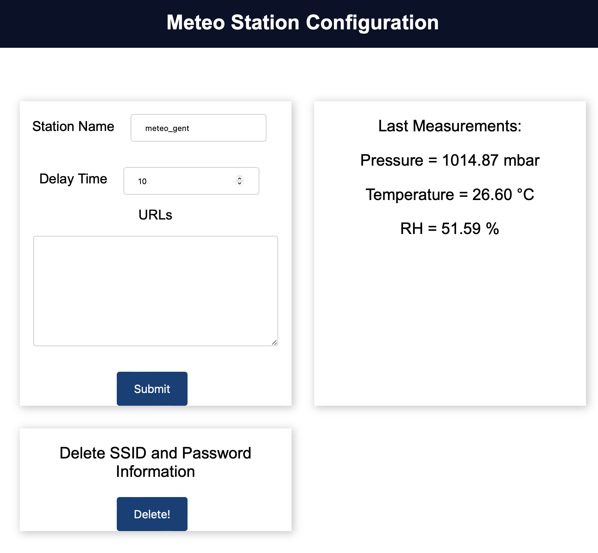

# Simple Meteo Station using esp32 + BME280

Simple meteo station to measure enviromental parameters (pressure, temperature and relative humidity).

The microcontroller is connected to the sensor BME280 using I2C and the data is collected frequently in a configurable time.

The env. parameters are sent via HTTP POST request to a server which will archive the data.

## Connections

| BME280      | ESP32       |
| ----------- | ----------- |
| VCC         | 3.3 V       |
| GND         | GND         |
| SDA         | GPIO21      |
| SCL         | GPIO22      |
| SDO         | GND         |
| CS          | 3.3 V       |

## Flashing the firmware

You should use the [PlatformIO](https://platformio.org). 

In the Platformio project tasks, first the filesystem should be uploaded by clicking `Platform > Upload Filesystem Image`. 

Then the board should be flashed by clicking  `General > Upload and Monitor`.


Platformio should be able to identify automatically the board port.

## Configuring the board

A WIFI Access Point will be created with the name `rpc_meteo_xxxxx` (xxxxx will be a id number of the chip), which the user has to connect to configure the wifi credentials.

After connecting, go to the web page `rpc_meteo_xxxxx.local` (xxxxx will be the same as the access point) and enter the credentials. If the webpage is not accessible, the user can connect directly to the default IP address of the board `192.168.1.1`. After submitting the credentials, the board will restart and connect to the set wifi. If it does not succeed, it will open the access point again, check your credentials details.


the configuration page where the other parameters of the board can be configured can be found in `rpc_meteo_xxxxx.local/config`.



Station name -> Name that will be sent in the POST request to the servers.
Delay time -> Number of seconds between the environmental data sending.
URLs -> List of URLs that to which the data will be sent. Write one URL per line.

## HTTP POST

The POST body is a JSON with the following body:

```
{"name": str("station_name"), "temp": float(T in °C), "pres": float(P in mbar), "humi": float(RH in %)}
```

it will be sent regularly within a delay time (default=30s), to the registered URLs, if no URL is registered, it will only fetch the sensor data which will be available in the configuration portal, but no POST request will be sent.

## Problems

If you have any problems, try checking the serial debug data of the esp32, to do that, either use the script `serial_monitor.py` or the `General > Monitor` Task in Platformio.

If the sensor is not found, check the wiring or the I2C address (it is configure in the bme.begin(address) function), it should be either 0x76 or 0x77 and depends on how the sensor is powered.

If you cannot access the board via `rpc_meteo_xxxxx.local`, you can access it directly via the ip address. It will be printed in the serial when it successfully connects or accessible in 192.168.1.1 if connected to the Access Point.

It is also worth trying to erase the esp32 flash and reflashing the firmware. Do all the configuration steps and try again.